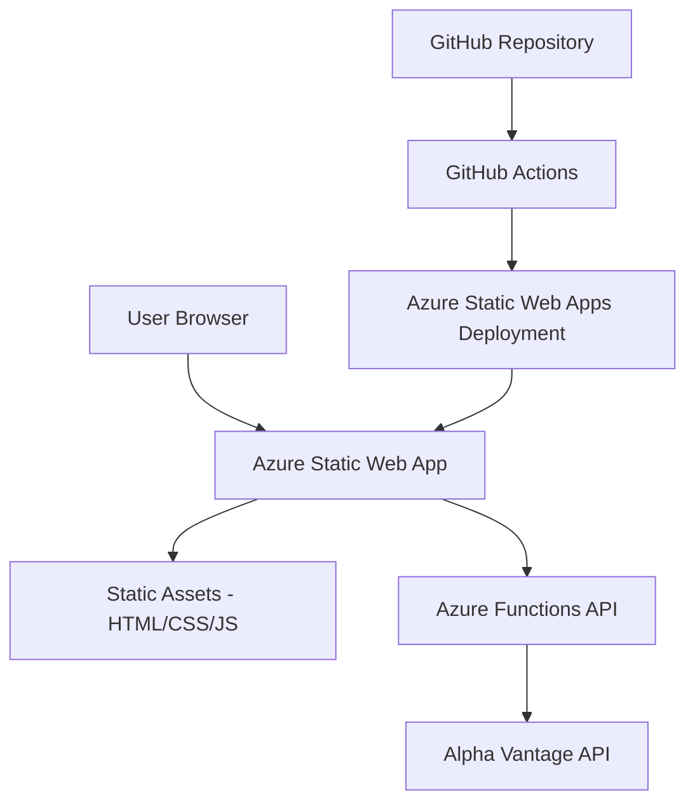

# Design Document

## Overview

The Stock Price Calculator is a modern, responsive web application that provides real-time stock price analysis with percentage-based price target calculations. The application will be built as a Single Page Application (SPA) using vanilla JavaScript/TypeScript, HTML5, and CSS3, optimized for Azure Static Web Apps deployment with GitHub Actions CI/CD.

## Architecture

### High-Level Architecture



### Technology Stack

- **Frontend**: HTML5, CSS3, TypeScript/JavaScript (ES6+)
- **Styling**: CSS Grid/Flexbox, CSS Custom Properties
- **Build Tools**: Vite or Webpack for bundling and optimization
- **Backend**: Azure Functions (Node.js) for API proxy
- **Hosting**: Azure Static Web Apps
- **CI/CD**: GitHub Actions
- **External API**: Alpha Vantage API for stock data

## Components and Interfaces

### Frontend Components

#### 1. Stock Search Component
- **Purpose**: Handle user input for stock symbol search
- **Interface**:
  ```typescript
  interface StockSearchProps {
    onSearch: (symbol: string) => void;
    isLoading: boolean;
  }
  ```
- **Functionality**: Input validation, search submission, loading states

#### 2. Stock Display Component
- **Purpose**: Show current stock price and company information
- **Interface**:
  ```typescript
  interface StockData {
    symbol: string;
    companyName: string;
    currentPrice: number;
    previousClose: number;
    lastUpdated: string;
  }
  ```

#### 3. Price Calculator Component
- **Purpose**: Display calculated price targets for gains and losses
- **Interface**:
  ```typescript
  interface PriceTargets {
    gains: {
      five: number;
      ten: number;
      fifteen: number;
    };
    losses: {
      five: number;
      ten: number;
      fifteen: number;
    };
  }
  ```

#### 4. Error Display Component
- **Purpose**: Handle and display error messages
- **Interface**:
  ```typescript
  interface ErrorState {
    message: string;
    type: 'api-error' | 'validation-error' | 'network-error';
  }
  ```

### Backend API Structure

#### Alpha Vantage Integration

**API Endpoint**: `https://www.alphavantage.co/query`
**Function Used**: `GLOBAL_QUOTE` - provides real-time and latest closing price information
**Rate Limits**: 5 API requests per minute, 500 requests per day (free tier)
**Response Format**: JSON with global quote data including previous close price

**Sample Alpha Vantage Response**:
```json
{
  "Global Quote": {
    "01. symbol": "AAPL",
    "02. open": "150.00",
    "03. high": "152.00",
    "04. low": "149.00",
    "05. price": "151.50",
    "06. volume": "50000000",
    "07. latest trading day": "2024-01-15",
    "08. previous close": "150.75",
    "09. change": "0.75",
    "10. change percent": "0.50%"
  }
}
```

#### Azure Functions Endpoints

1. **GET /api/stock/{symbol}**
   - Fetch stock data for given symbol using Alpha Vantage GLOBAL_QUOTE endpoint
   - API URL: `https://www.alphavantage.co/query?function=GLOBAL_QUOTE&symbol={symbol}&apikey={key}`
   - Handle rate limiting (5 calls/minute, 500 calls/day)
   - Implement 5-minute response caching
   - Return standardized response format

2. **GET /api/health**
   - Health check endpoint
   - Verify Alpha Vantage API connectivity and quota status

### API Response Format

```typescript
interface StockResponse {
  success: boolean;
  data?: {
    symbol: string;
    companyName: string;
    currentPrice: number;
    previousClose: number;
    lastUpdated: string;
    currency: string;
  };
  error?: {
    code: string;
    message: string;
  };
}
```

## Data Models

### Stock Data Model
```typescript
class Stock {
  symbol: string;
  companyName: string;
  currentPrice: number;
  previousClose: number;
  lastUpdated: Date;
  currency: string;

  constructor(data: StockData) {
    this.symbol = data.symbol.toUpperCase();
    this.companyName = data.companyName;
    this.currentPrice = this.roundPrice(data.currentPrice);
    this.previousClose = this.roundPrice(data.previousClose);
    this.lastUpdated = new Date(data.lastUpdated);
    this.currency = data.currency || 'USD';
  }

  private roundPrice(price: number): number {
    return Math.round(price * 100) / 100;
  }

  calculateTargets(): PriceTargets {
    const basePrice = this.previousClose;
    return {
      gains: {
        five: this.roundPrice(basePrice * 1.05),
        ten: this.roundPrice(basePrice * 1.10),
        fifteen: this.roundPrice(basePrice * 1.15)
      },
      losses: {
        five: this.roundPrice(basePrice * 0.95),
        ten: this.roundPrice(basePrice * 0.90),
        fifteen: this.roundPrice(basePrice * 0.85)
      }
    };
  }
}
```

### Application State Model
```typescript
interface AppState {
  currentStock: Stock | null;
  isLoading: boolean;
  error: ErrorState | null;
  searchHistory: string[];
}
```

## Error Handling

### Frontend Error Handling
1. **Input Validation**: Client-side validation for stock symbols (1-5 characters, letters only)
2. **Network Errors**: Retry logic with exponential backoff
3. **API Errors**: User-friendly error messages based on error codes
4. **Fallback UI**: Graceful degradation when services are unavailable

### Backend Error Handling
1. **Rate Limiting**: Implement request throttling to stay within Alpha Vantage limits (5 calls/minute)
2. **Timeout Handling**: Set 10-second timeout for Alpha Vantage API calls
3. **Caching**: Implement 5-minute response caching to reduce API calls and improve performance
4. **API Key Management**: Store Alpha Vantage API key securely in Azure Key Vault
5. **Quota Monitoring**: Track daily API usage to prevent quota exhaustion
6. **Logging**: Comprehensive logging for debugging and monitoring

### Error Codes and Messages
```typescript
const ERROR_MESSAGES = {
  'INVALID_SYMBOL': 'Please enter a valid stock symbol (1-5 letters)',
  'SYMBOL_NOT_FOUND': 'Stock symbol not found. Please check the symbol and try again.',
  'API_UNAVAILABLE': 'Stock data service is temporarily unavailable. Please try again later.',
  'NETWORK_ERROR': 'Network connection error. Please check your internet connection.',
  'RATE_LIMITED': 'Too many requests. Please wait a moment before searching again.'
};
```

## Testing Strategy

### Unit Testing
- **Frontend**: Jest + Testing Library for component testing
- **Backend**: Jest for Azure Functions testing
- **Coverage Target**: 80% code coverage minimum

### Integration Testing
- **API Integration**: Test external API integration with mock responses
- **End-to-End**: Playwright for critical user journeys

### Performance Testing
- **Load Testing**: Test API endpoints under load
- **Frontend Performance**: Lighthouse CI for performance monitoring

### Test Scenarios
1. **Valid Stock Symbol Search**: Test successful stock data retrieval and calculation
2. **Invalid Stock Symbol**: Test error handling for non-existent symbols
3. **API Failure**: Test graceful degradation when external API is unavailable
4. **Network Failure**: Test offline behavior and error messaging
5. **Price Calculation Accuracy**: Test mathematical accuracy of percentage calculations
6. **Responsive Design**: Test UI across different screen sizes

## Deployment and CI/CD

### GitHub Actions Workflow
```yaml
# Key workflow steps:
# 1. Build and test frontend assets
# 2. Run unit and integration tests
# 3. Deploy to Azure Static Web Apps
# 4. Run smoke tests against deployed application
```

### Environment Configuration
- **Development**: Local development with mock API responses
- **Staging**: Azure Static Web Apps staging slot with test API keys
- **Production**: Production deployment with production API keys

### Security Considerations
- API keys stored in Azure Key Vault
- CORS configuration for Azure Static Web Apps
- Input sanitization and validation
- Rate limiting to prevent abuse

## Performance Optimization

### Frontend Optimization
- Code splitting and lazy loading
- Image optimization and compression
- CSS and JavaScript minification
- Service worker for offline functionality

### Backend Optimization
- Response caching (5-minute cache for Alpha Vantage stock data)
- Request queuing to respect Alpha Vantage rate limits
- Connection pooling for Alpha Vantage API calls
- Gzip compression for API responses

### Monitoring and Analytics
- Application Insights for performance monitoring
- Custom metrics for API usage and error rates
- User analytics for feature usage tracking